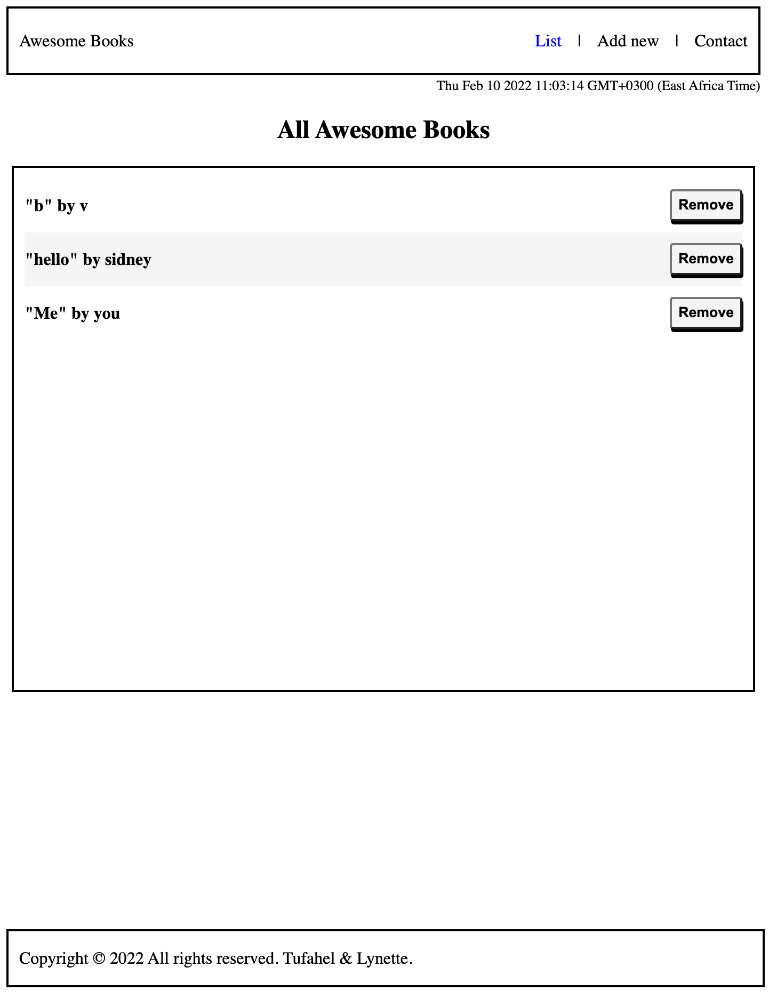

# Awesome-books
> This project is about a library where you add a book title and the author and remove books from the list

## Built With
- HTML
- Javascript
- VScode
## Live Demo
For the link to the live demo, [Click here](https://ilynette.github.io/awesome-books/)
## Getting Started
To get a local copy up and running you just need to follow the following steps;
-Clone this repository with
git clone https://github.com/iLynette/awesome-books.git using your terminal or command line.
-Change to the project directory by entering :
cd awesome-books in the terminal.
-run code . to open it in vscode

## Authors

👤 **Author1**

- GitHub: [@iLynette](https://github.com/iLynette)
- Twitter: [@acholah_lynette](https://twitter.com/acholah_lynette)
- LinkedIn: [acholah lynette](https://www.linkedin.com/in/lynette-acholah/)

👤 **Author2**

- GitHub: [@Tufahel](https://github.com/Tufahel)
- LinkedIn: [Tufahel Ahmed](https://bd.linkedin.com/in/tufahel-ahmed-972884203)

## 🤝 Contributing

Contributions, issues, and feature requests are welcome!

Feel free to check the [issues page](../../issues/).

## Show your support

Give a ⭐️ if you like this project!

## Acknowledgments

- Hat tip to anyone whose code was used
- Inspiration
- etc

## 📝 License

This project is [MIT](./MIT.md) licensed.
